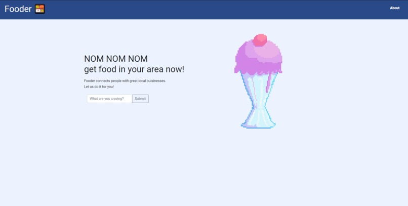
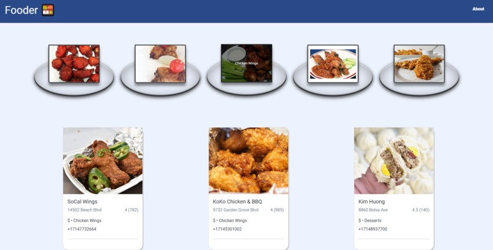

# 🌎 Fooder - API World Hackathon 2022

## 💡 Inspiration
So lets say Jake just moved to LA, a new city, no friends to take him anywhere, and has not eaten all day! Wow his day cannot get any worse. We wanted to help Jake one step at a time and the first thing was to find him some food. Our inspiration was to find a way for users to find all sorts of food around them by just simply typing in whatever they want to eat.

## 💻 What it does
Fooder is a food search web application that would allow users to quickly find multiple restaurant locations of savory and delicious food. We will ask you for your location services and with that we can directly pinpoint you position wherever you are and give you food in your location.

## ⚙️ How we built it
Our website is built entirely with HTML5, CSS3, and JavaScript. Launched a framework called Bootstrap that allowed us to use style our website. For our APIs, we used two APIs: Spoonacular and YelpAPI. Spoonacular gave us the ability to use a information (data) of different types of food and manipulate the data where we could let the user find any type of food of their choice. The YelpAPI calls would allow us to find different restaurants and store data and by taking SpoonacularsAPI calls and manipulating the data moving forward into Yelp's API, we would be able to accomplish our goal to allow the user to get any type of food in his/her area!

## 🧩 Challenges we ran into
We encountered the CORS policy which would block us from using the YelpAPI key in the frontend of the application. YelpAPI key according to yelp only wants the key in the backend because they want to keep secrecy with key to prevent publicly exposing your credentials which could result to your account being compromised (ONLINE THEFT EXIST). So a way around it was we used a proxy that would bypass the CORS policy called nameless-scrubland-76048.herokuapp.com and allowing us to run it on the frontend side of things. It was extremely difficult to find simply but we eventually were able to solve the problem.

## 🎉 Accomplishments that we're proud of
We are proud of this project because now people like Jake who know nothing about where he is can at least have a meal that he desires. That little step can go a long way. Being able to use two APIs both impacted and had relevance to our project made the project feel like it was really coming together. Very proud of the design that we have made, its simple and easily accessible for our lovely Fooder user. And lastly proud of our team for keeping it together the whole way through, when problems erupted, being able to stop and really think about the situation really helped us move forward.

## 📖 What we learned
Our group has learned more design functionality for HTML5 and CSS. There are many ways to approach a design which makes it hard when it comes to choosing because the options are endless sometimes. Finding one and sticking to it is the hard part. We also got more in touch with JS allowing our website to come to life and make it look fancy. We originally took this Hackathon because we saw API and that is definitely what we got out of it. We were able to learn different kinds of APIs and how to put them into the code and eventually fully functional in our web application, Fooder.

## ❓ What's next for Fooder
The next step forward for Fooder is to deliver food straight to your doorstep, office, wherever, whenever. We want our users to have less a emphasis on worrying about eating and being able to go about their day.

## 🤝 Collaborators

[Jacky Cai](https://github.com/Yun8caiii)

[Nhan Nguyen](https://github.com/nhanng19)

## 🚀 Submission
This project was submitted to the API World Hackathon 2022 [here](https://devpost.com/software/fooder-gtnmkz).

You can also try out the [live demo](https://github.com/nhanng19/Fooder).